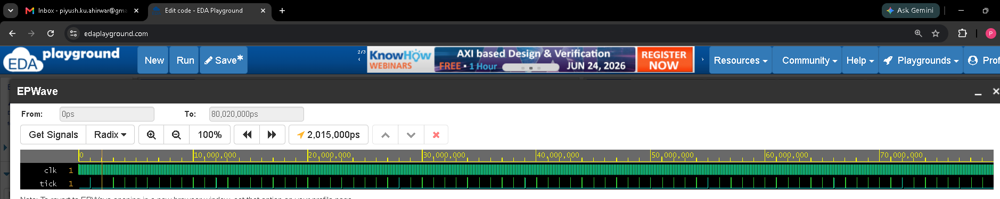
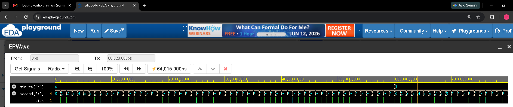
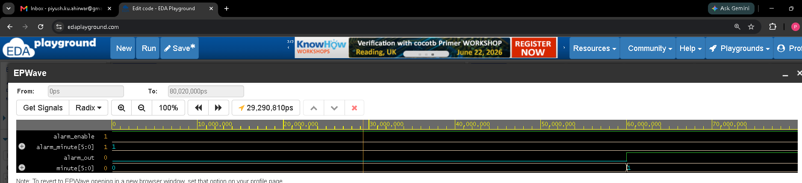
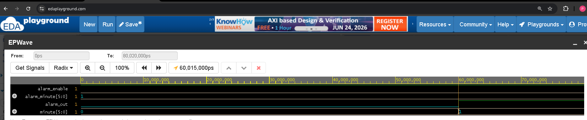
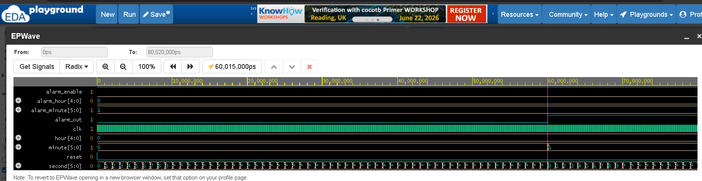

# VLSI Digital Clock with Alarm Functionality

## Overview

This project implements a VLSI-Based Digital Clock with Alarm Functionality using Verilog HDL. The design maintains time in 24-hour format (HH:MM:SS) and generates an alarm signal when the current time matches a user-defined alarm time.

The project demonstrates fundamental digital design concepts such as clock division, synchronous counters, comparator logic, RTL design, functional verification, and waveform analysis.

---

## Features

* 24-hour digital clock
* Seconds counter (0–59)
* Minutes counter (0–59)
* Hours counter (0–23)
* Clock divider for time generation
* Alarm enable functionality
* Alarm comparator logic
* Modular RTL design
* Verilog HDL implementation
* Functional verification using EDA Playground and EPWave

---

## Project Architecture

Clock Input
→ Clock Divider
→ Seconds Counter
→ Minutes Counter
→ Hours Counter
→ Alarm Comparator
→ Alarm Output

Current Time
→ Seven-Segment Decoder (Optional)
→ Display Output

---

## RTL Modules

### clock_divider.v

Generates periodic tick pulses from the system clock.

### digital_clock.v

Implements cascading counters for seconds, minutes, and hours.

### alarm_comparator.v

Compares current time with alarm time and generates alarm output.

### seven_seg_decoder.v

Converts decimal digits into seven-segment display patterns.

### top.v

Top-level integration module connecting all submodules.

---

## Alarm Logic

Alarm is generated when:

alarm_enable = 1

AND

current_hour = alarm_hour

AND

current_minute = alarm_minute

When all conditions are satisfied, alarm_out becomes HIGH.

---

## Simulation Results

The design was verified through simulation using EDA Playground.

### Verified Functionalities

* Clock divider operation
* Seconds counter increment
* Minute rollover
* Alarm time comparison
* Alarm output generation

---

## Waveform Screenshots

### Clock Divider

### Minute Rollover

### Alarm Trigger

 

### Complete System Waveform

---

## Folder Structure

VLSI-Digital-Clock-with-Alarm/

├── rtl/

├── tb/

├── images/

├── docs/

├── README.md

└── .gitignore

---

## Tools Used

* Verilog HDL
* EDA Playground
* EPWave
* GitHub

---

## Learning Outcomes

Through this project, the following concepts were learned:

* RTL Design
* Verilog HDL Coding
* Clock Divider Design
* Counter Design
* Comparator Logic
* Digital System Integration
* Functional Verification
* Waveform Analysis
* FPGA/VLSI Design Flow

---

## Future Improvements

* FPGA implementation
* Seven-segment display integration
* Push-button time setting
* Alarm setting mode
* Snooze functionality
* 12-hour and 24-hour modes
* Real-Time Clock (RTC) integration

---

## Acknowledgement

I would like to express my sincere gratitude to **Mr. Umesh Yadav (Indian Institute of Placement -IIP)for his valuable guidance, mentorship, and continuous support throughout this project. His insights into RTL design, verification methodologies, and VLSI fundamentals played a significant role in the successful completion of this work.

I am thankful for the knowledge, encouragement, and practical understanding gained during this project, which helped strengthen my skills in digital design and hardware development.

---

## Author

Piyush Kumar Ahirwar

Computer Science & Engineering

VLSI / FPGA / Digital Design Enthusiast

